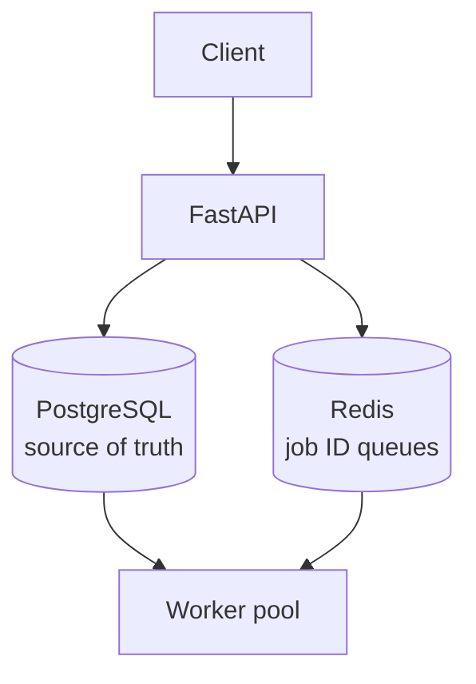

# Distributed Job Queue System

A background job processing system built from scratch in Python — the
kind of infrastructure that sits behind "your order is confirmed, email
on its way." Similar in spirit to Celery or BullMQ.

**Status:** In development (Day 35 of 60 - Week 5 complete)

## The problem

When you place an order, the app must save it and respond instantly.
But it also needs to send a confirmation email, an SMS, notify the
restaurant. Doing all that inline would make the user wait seconds.

Instead, those side effects are pushed onto a queue and handled by
background workers. This project is that queue system.

## Architecture


PostgreSQL holds the full job record and is the single source of truth.
Redis holds only job IDs, acting as a lightweight waiting line. Workers
pop an ID from Redis, then load the full job from PostgreSQL.

## Tech stack

- **Python 3 / FastAPI** — API layer
- **PostgreSQL / SQLAlchemy** — job persistence
- **Redis** — job queues (Lists now, Sorted Sets for priority later)
- **Pydantic** — request validation

## Implemented so far

- [x] FastAPI server with health checks
- [x] PostgreSQL connection via SQLAlchemy ORM
- [x] Redis connection
- [x] `jobs` table schema with status/priority enums, retry tracking
- [x] `POST /jobs` — submit a job (201), persisted as `PENDING`
- [x] `GET /jobs/{id}` — fetch job status (200/404)
- [x] Pydantic request/response schemas with case-insensitive priority
- [x] Project restructured: `app/` package with `routers/` for endpoints
- [x] 3 worker processes running in parallel via multiprocessing launcher
- [x] Conditional claim prevents duplicate processing
- [x] Jobs marked SUCCESS or FAILED after processing, errors captured
- [x] Priority queues migrated from 3 Redis Lists to 1 Sorted Set
- [x] Weighted round-robin selection prevents priority starvation
      (verified under load — see below)
- [x] Priority weights configurable in one place (`app/config.py`)
- [x] `GET /jobs/stats/queue` — live queue depth by priority tier
- [x] Handler registry — job types dispatch to registered functions
      (`worker/handlers.py`), with per-handler payload validation
- [x] `POST /jobs/{id}/retry` — manual retry for DEAD/FAILED jobs
- [x] `GET /jobs/status/{status}` — list jobs by status (DLQ inspection)

## Roadmap

- [ ] `GET /jobs/{id}` — job status lookup
- [ ] Worker processes via Python multiprocessing
- [ ] Priority queues using Redis Sorted Sets
- [ ] Retry with exponential backoff + Dead Letter Queue
- [ ] Orphan/reconciliation sweeper
- [ ] Live dashboard over WebSockets
- [ ] Docker Compose for the full stack
- [ ] Deployment

### Not Yet Implemented

- **Job event history table** — append-only audit trail of every status change per job. Currently, failure history is overwritten on retry.
- **Idempotent handlers** — dedup keys to prevent duplicate side effects
  when a job is re-processed after worker death.
- **Graceful worker shutdown** — catch SIGTERM, finish current job before stopping, to avoid unnecessary orphan recovery.

## Data model

The `jobs` table:

| Column | Type | Purpose |
|---|---|---|
| `id` | UUID | Generated client-side friendly ID; avoids collisions across services |
| `type` | String | Which handler runs, e.g. `send_email` |
| `payload` | JSON | Handler input — schemaless so one table serves all job types |
| `status` | Enum | PENDING / RUNNING / SUCCESS / FAILED / DEAD |
| `priority` | Enum | HIGH / MEDIUM / LOW |
| `retry_count` | Integer | Attempts so far |
| `max_retries` | Integer | Per-job retry limit |
| `next_retry_at` | Timestamp | Earliest time this may be retried |
| `error_message` | Text | Most recent failure reason |
| `created_at` / `updated_at` | Timestamp | Bookkeeping |

`FAILED` is transient (a retry is pending); `DEAD` is terminal.

## Design notes

**Why UUIDs?** In a distributed system, IDs may be generated in several
places at once. UUIDs remove the need for a central counter.

**Why a JSON payload?** Different job types need entirely different
inputs. A schemaless column supports new job types without migrations.

**Why store only the ID in Redis?** Storing the full job in both systems
would mean two copies that can drift apart. Redis is a pointer;
PostgreSQL is the truth.

See [NOTES.md](./NOTES.md) for known trade-offs and failure modes.

**Why a handler registry?** The worker knows how to claim jobs, handle
failures, and record outcomes. It knows nothing about what a job does.
Job types map to handler functions in a registry, so adding a new job
type never touches worker loop logic — the same separation Celery and
BullMQ use.

## Running locally

Requires PostgreSQL and Redis running locally.

```bash
python -m venv venv
source venv/bin/activate
pip install -r requirements.txt

cp .env.example .env      # then fill in your credentials

uvicorn app.main:app --reload
```

Interactive API docs: http://localhost:8000/docs
 
## Priority Queues with Starvation Prevention

Jobs are queued in a single Redis Sorted Set where the score encodes priority (HIGH=1, MEDIUM=5, LOW=10). Workers don't simply take the lowest score — that would starve LOW-priority jobs under sustained HIGH load. Instead, each worker walks a weighted round-robin cycle (6 HIGH : 3 MEDIUM : 1 LOW), targeting a specific tier on each pick 
via ZRANGEBYSCORE + ZREM. If the scheduled tier is empty, the worker falls back to a global BZPOPMIN rather than idling.

Verified under load: with 40 HIGH jobs and 3 LOW jobs pre-loaded, 2 out of 3 LOW jobs completed while HIGH jobs were still being processed. LOW jobs waited ~29s vs HIGH's ~11-37s range — slower by design, but not starved.

Balanced load test (60 HIGH / 30 MEDIUM / 30 LOW):

| Priority | Jobs | Avg wait | Max wait | Direct hits |
|----------|------|----------|----------|-------------|
| HIGH     | 60   | 78s      | 106s     | 42 (57%)    |
| MEDIUM   | 30   | 93s      | 116s     | 21 (29%)    |
| LOW      | 30   | 115s     | 130s     | 10 (14%)    |

Target ratio 60/30/10 — measured 57/29/14. All tiers completed.


## Fault Tolerance and Recovery

Failed jobs retry with exponential backoff and jitter (5s → 10s → 20s,
±50% randomised, capped near 5 minutes). Delays are never slept by the
worker — the failure records a `next_retry_at` timestamp and the worker
moves on immediately.

A reconciliation sweeper runs every 5 seconds and repairs three
divergences between PostgreSQL (source of truth) and Redis (pointer queue):

| Case | Cause | Repair |
|---|---|---|
| FAILED, retry due | Normal backoff cycle | Reset to PENDING, re-queue |
| PENDING, stuck >60s | Dual-write: DB commit succeeded, Redis push lost | Re-queue |
| RUNNING, stale >60s | Worker died mid-job | Reset to PENDING, re-queue |

Failures are classified as transient or permanent. Permanent failures
(unknown job type, malformed payload) skip retry entirely and go straight
to DEAD, rather than burning the retry budget on a guaranteed-identical
outcome. Transient failures get the full backoff cycle, and jobs exceeding
`max_retries` are marked DEAD — preserved with their error message for
inspection and manual retry.

Jobs that exhaust their retries — or fail permanently — are preserved as
DEAD with their error message rather than discarded. `GET /jobs/status/DEAD`
lists them for inspection and `POST /jobs/{id}/retry` re-queues one with a
fresh retry budget, for the case where an outage outlasted the automated
retry window and a human has since fixed the root cause.

**Known limitation:** manual retry resets `retry_count` and clears
`error_message`, so previous failure history is lost from the jobs table.
The proper fix is an append-only `job_events` table recording every status
change — not yet implemented, as the queue infrastructure was the priority.

## Testing

Load and integration scripts live in `experiments/`:

- `flood_high.py` — deliberately imbalanced load; verifies LOW-priority
  jobs are not starved under sustained HIGH pressure.
- `balanced_load.py` — balanced load across all tiers; makes the configured
  6:3:1 throughput ratio measurable.
- `integration_test.py` — mixed workload exercising every path at once:
  clean jobs, transient failures that recover, failures that exhaust the
  retry budget, and permanent failures, across all three priority tiers.

The primary integration assertion is that no job remains in a non-terminal
state: after the run, every job is `SUCCESS` or `DEAD`, with zero `PENDING`,
`RUNNING`, or `FAILED`.

`GET /jobs/stats/health` compares Redis queue depth against the PostgreSQL
`PENDING` count. These match when idle; persistent divergence indicates jobs
whose Redis push was lost, which the sweeper repairs.