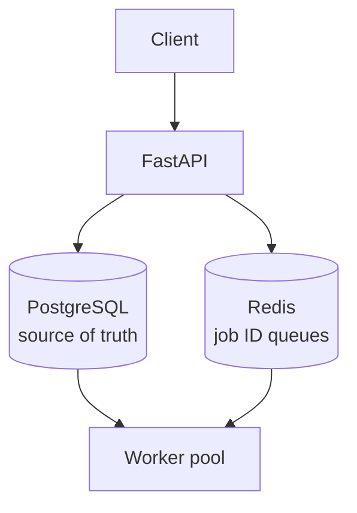

# Distributed Job Queue System

A background job processing system built from scratch in Python — the
kind of infrastructure that sits behind "your order is confirmed, email
on its way." Similar in spirit to Celery or BullMQ.

**Status:** In development (Day 11 of 60)

## The problem

When you place an order, the app must save it and respond instantly.
But it also needs to send a confirmation email, an SMS, notify the
restaurant. Doing all that inline would make the user wait seconds.

Instead, those side effects are pushed onto a queue and handled by
background workers. This project is that queue system.

## Architecture


PostgreSQL holds the full job record and is the single source of truth.
Redis holds only job IDs, acting as a lightweight waiting line. Workers
pop an ID from Redis, then load the full job from PostgreSQL.

## Tech stack

- **Python 3 / FastAPI** — API layer
- **PostgreSQL / SQLAlchemy** — job persistence
- **Redis** — job queues (Lists now, Sorted Sets for priority later)
- **Pydantic** — request validation

## Implemented so far

- [x] FastAPI server with health checks
- [x] PostgreSQL connection via SQLAlchemy ORM
- [x] Redis connection
- [x] `jobs` table schema with status/priority enums, retry tracking
- [x] `POST /jobs` — submit a job (201), persisted as `PENDING`
- [x] Job ID pushed to the matching Redis priority queue
- [x] `GET /jobs/{id}` — fetch job status (200/404)
- [x] Pydantic request/response schemas with case-insensitive priority
- [x] Project restructured: `app/` package with `routers/` for endpoints

## Roadmap

- [ ] `GET /jobs/{id}` — job status lookup
- [ ] Worker processes via Python multiprocessing
- [ ] Priority queues using Redis Sorted Sets
- [ ] Retry with exponential backoff + Dead Letter Queue
- [ ] Live dashboard over WebSockets
- [ ] Docker Compose for the full stack

## Data model

The `jobs` table:

| Column | Type | Purpose |
|---|---|---|
| `id` | UUID | Generated client-side friendly ID; avoids collisions across services |
| `type` | String | Which handler runs, e.g. `send_email` |
| `payload` | JSON | Handler input — schemaless so one table serves all job types |
| `status` | Enum | PENDING / RUNNING / SUCCESS / FAILED / DEAD |
| `priority` | Enum | HIGH / MEDIUM / LOW |
| `retry_count` | Integer | Attempts so far |
| `max_retries` | Integer | Per-job retry limit |
| `next_retry_at` | Timestamp | Earliest time this may be retried |
| `error_message` | Text | Most recent failure reason |
| `created_at` / `updated_at` | Timestamp | Bookkeeping |

`FAILED` is transient (a retry is pending); `DEAD` is terminal.

## Design notes

**Why UUIDs?** In a distributed system, IDs may be generated in several
places at once. UUIDs remove the need for a central counter.

**Why a JSON payload?** Different job types need entirely different
inputs. A schemaless column supports new job types without migrations.

**Why store only the ID in Redis?** Storing the full job in both systems
would mean two copies that can drift apart. Redis is a pointer;
PostgreSQL is the truth.

See [NOTES.md](./NOTES.md) for known trade-offs and failure modes.

## Running locally

Requires PostgreSQL and Redis running locally.

```bash
python -m venv venv
source venv/bin/activate
pip install -r requirements.txt

cp .env.example .env      # then fill in your credentials

uvicorn app.main:app --reload
```

Interactive API docs: http://localhost:8000/docs
